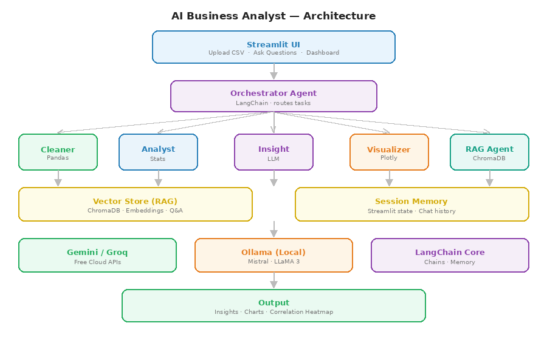

# 🤖 Agentic Business Intelligence System

AI system that **automatically analyzes datasets and generates business insights** using LLM agents.

Upload a CSV → the system cleans the data, performs analysis, builds charts, and explains insights in plain English.

---

## 🚀 Features

- Upload any **CSV dataset**
- Automatic **data cleaning**
- **Statistical analysis** and trend detection
- **AI-generated business insights**
- **Interactive dashboards** with charts
- **Natural language Q&A** on data (RAG)
- **PDF report export**

---

## 🛠 Tech Stack

- **Python**
- **Streamlit** – UI dashboard  
- **LangChain** – agent orchestration  
- **LLMs** – Gemini / Groq / Ollama  
- **ChromaDB** – vector database for RAG  
- **Pandas & NumPy** – data processing  
- **Plotly** – visualizations  

---

